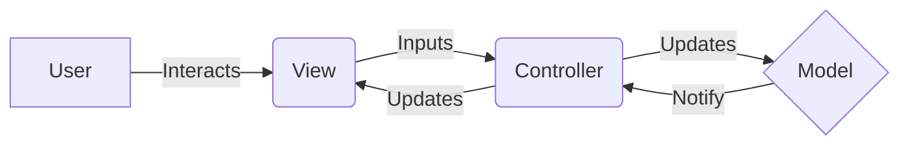

<div align="center">

# 🏧 FreeATM

**Your Personal Console Banking Assistant**

[](https://www.java.com/)
[](https://github.com/kutraleeswaran)

<p align="center">
  A robust, lightweight, and efficient ATM simulation built to demonstrate <br> 
  <b>Object-Oriented Design</b> and the <b>MVC Architecture</b>.
</p>

[View Demo](#-demo) • [Key Features](#-key-features) • [Architecture](#-architecture) • [Getting Started](#-getting-started)

</div>

---

## 📖 Overview

**FreeATM** provides a seamless Command Line Interface (CLI) experience for essential banking operations. Designed with clean code principles in mind, it serves as a perfect reference for understanding how to structure Java applications using the **Model-View-Controller (MVC)** pattern without the overhead of heavy frameworks.

---

## ✨ Key Features

### 🔐 Secure Authentication
| Feature | Description |
| :--- | :--- |
| **Smart Login** | Secure access to your personal account. |
| **Easy Signup** | Instant registration with built-in duplicate user validation. |

### 💰 Core Banking
| Feature | Description |
| :--- | :--- |
| **Real-time Balance** | Check your funds instantly with zero latency. |
| **Cash Deposit** | Add funds to your account securely. |
| **Withdrawal** | Withdraw cash with automatic balance validation. |

### ⚙️ Technical Highlights
*   **Singleton Pattern**: utilized for the `UserRepository` to ensure data consistency.
*   **In-Memory Database**: Fast and reliable data persistence during runtime.
*   **MVC Structure**: distinct separation of business logic, UI, and control flow.

---

## 🏗️ Architecture

The project strictly follows the **MVC** design pattern to ensure scalability and maintainability.



*   **🟦 Model**: The brain. Manages data (`User`) and business logic.
*   **🟩 View**: The face. Handles all console output and user input.
*   **🟧 Controller**: The bridge. Orchestrates the flow between the user and the system.

---

## 🚀 Getting Started

Follow these simple steps to get FreeATM running on your local machine.

### Prerequisites

*   **Java Development Kit (JDK)** 8 or higher.

### 📥 Installation & Run

1.  **Clone the Repository**
    ```sh
    git clone https://github.com/yourusername/FreeATM.git
    cd FreeATM
    ```

2.  **Compile the Project**
    ```sh
    javac -d out -sourcepath src src/FreeATM.java
    ```

3.  **Launch the Application**
    ```sh
    java -cp out FreeATM
    ```

---

## 📂 Project Structure

A glimpse into how we organized the code:

```bash
FreeATM/
├── src/
│   ├── FreeATM.java           # 🚀 Application Entry Point
│   └── com/freeatm/
│       ├── base/              # 🏗️ Base MVC Classes
│       ├── constants/         # 📝 String Literals & Config
│       ├── database/          # 💾 In-Memory Data Store
│       ├── dto/               # 📦 Data Transfer Objects
│       ├── home/              # 🏠 Dashboard Logic
│       ├── login/             # 🔑 Authentication Logic
│       ├── registration/      # 📝 Signup Logic
│       └── welcome/           # 👋 Landing Screen
└── readme.md
```

---

<div align="center">

<br/>

### 👨‍💻 Made with ❤️ by Kutraleeswaran

<br/>

[](https://github.com/)

</div>
